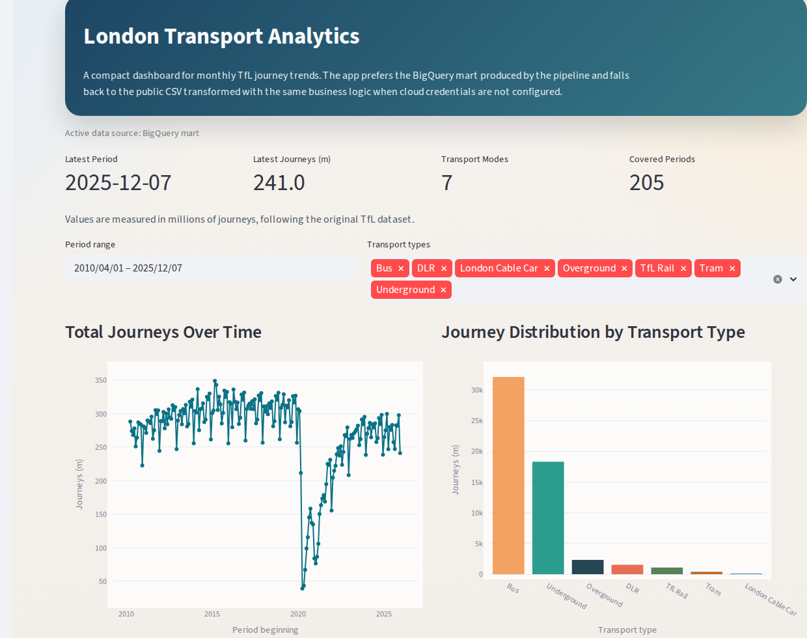
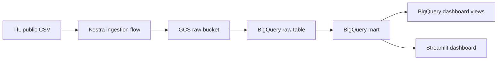

# London Transport Analytics

End-to-end batch analytics project for London public transport demand, built as a DataTalksClub Data Engineering Zoomcamp course project.

<p align="center">
  
</p>

## Problem statement

Transport demand changes over time because of seasonality, long-term mobility shifts, and external events. The source dataset is published as a CSV by Transport for London, but manual analysis makes it difficult to:

- keep the data lake and warehouse in sync
- compare trends across transport modes over time
- reuse the same transformed dataset for both BI and ad hoc analysis

This project solves that by building a reproducible batch pipeline that:

1. downloads the official TfL CSV
2. stores the raw snapshot in Google Cloud Storage
3. loads the latest file into BigQuery
4. transforms the raw wide table into an analytical mart
5. exposes the result through dashboard-ready views and a Streamlit dashboard

Main analytical questions:

- How have total public transport journeys changed over time?
- Which transport modes contribute the most journeys overall?
- How does the transport mix change across reporting periods?

## Dataset

Source dataset: TfL Public Transport Journeys by Type of Transport

- Dataset page: `https://data.london.gov.uk/dataset/public-transport-journeys-type-transport`
- CSV used by the pipeline: `https://data.london.gov.uk/download/ep8ow/06a805f6-77c6-481a-8b08-ddef56afffdd/tfl-journeys-type.csv`
- Grain in the source: one record per reporting period with journey counts split across transport modes

Source columns used downstream:

- `Period and Financial year`
- `Reporting Period`
- `Days in period`
- `Period beginning`
- `Period ending`
- `Bus journeys (m)`
- `Underground journeys (m)`
- `DLR Journeys (m)`
- `Tram Journeys (m)`
- `Overground Journeys (m)`
- `London Cable Car Journeys (m)`
- `TfL Rail Journeys (m)`

## Architecture



## Tech stack

| Layer | Technology |
|---|---|
| Cloud | GCP |
| Data lake | Google Cloud Storage |
| Data warehouse | BigQuery |
| Infrastructure as code | Terraform |
| Orchestration | Kestra |
| Transformations | BigQuery SQL orchestrated by Kestra |
| Dashboard | Streamlit |
| Local runtime | Docker, Python, WSL2 / Ubuntu |

## Pipeline design

This project uses a batch pipeline.

### Kestra flows

- `set_kv`: initializes project KV pairs
- `data_load_gcs`: downloads the CSV and uploads it to GCS
- `gcs_to_bigquery_raw`: loads the latest raw file into BigQuery
- `build_mart_bigquery`: parses, reshapes, and optimizes the analytical mart
- `build_dashboard_views_bigquery`: creates the two BI views
- `end_to_end_pipeline`: runs the four pipeline stages above in sequence

### Cloud resources

- GCS bucket: `london-transport-analytics-raw-711265235468`
- BigQuery dataset: `london_transport_dw`

### Data model

| Object | Type | Purpose |
|---|---|---|
| `transport_journeys_raw` | BigQuery table | Raw landed snapshot loaded from the latest GCS CSV |
| `transport_journeys_mart` | BigQuery table | Analytics-ready long-format mart |
| `transport_journeys_over_time_v` | BigQuery view | Time-series aggregation for dashboard trend chart |
| `transport_type_distribution_v` | BigQuery view | Category aggregation for dashboard distribution chart |

### Warehouse optimization

The mart table is optimized for dashboard queries:

- partitioned by `period_beginning_date`
- clustered by `transport_type`

That directly supports the two core dashboard access patterns:

- temporal trend analysis
- distribution by transport category

## Dashboard

The Streamlit dashboard contains the two required Zoomcamp tiles:

- `Total Journeys Over Time`: temporal line chart
- `Journey Distribution by Transport Type`: categorical distribution chart

The app prefers the BigQuery mart and falls back to the public CSV only if cloud credentials are not configured.

Dashboard preview image:

- [dashboard/assets/london_transport_dashboard_focus.png](dashboard/assets/london_transport_dashboard_focus.png)

## Zoomcamp criteria mapping

This repository is structured to match the project evaluation criteria.

| Criterion | Implementation |
|---|---|
| Problem description | Clear transport-demand problem statement and analytical questions |
| Cloud | GCP is used for GCS and BigQuery |
| IaC | Terraform provisions the bucket and BigQuery dataset |
| Batch / orchestration | Kestra runs the full end-to-end DAG |
| Data warehouse | BigQuery raw + optimized mart table |
| Transformations | SQL-based transformation logic executed through Kestra |
| Dashboard | Streamlit dashboard with 2 tiles |
| Reproducibility | Step-by-step setup and run instructions included |

## Repository structure

```text
london-transport-analytics/
|-- README.md
|-- scripts/
|-- Terraform/
|-- Kestra/
|-- warehouse/
|-- transformations/
|-- dashboard/
```

## Reproducibility

The project was validated on Ubuntu in WSL2. PowerShell helper scripts are also included for Windows users.

### 1. Prerequisites

Required locally:

- Docker
- Docker Compose
- Python 3.11+
- Terraform
- Google Cloud SDK

For Ubuntu / WSL2, the repository includes bootstrap helpers:

```bash
chmod +x scripts/*.sh
./scripts/bootstrap_linux.sh --install-dashboard-deps
./scripts/check_prereqs.sh
```

Notes:

- Docker can come either from Docker Desktop WSL integration or a native Linux install.
- `terraform` and `gcloud` are installed into `$HOME/.local` by the Linux bootstrap script.
- PowerShell equivalents are available in `scripts/` if you prefer Windows-native setup.

### 2. GCP project and service account

Create or choose a GCP project, enable billing, and make sure these APIs are enabled:

- `storage.googleapis.com`
- `bigquery.googleapis.com`
- `iam.googleapis.com`
- `serviceusage.googleapis.com`

Create a service account with at least:

- `Storage Admin`
- `BigQuery Admin`

Export the service account key path for Terraform and the dashboard:

```bash
export GOOGLE_APPLICATION_CREDENTIALS="/path/to/service-account.json"
```

### 3. Provision infrastructure with Terraform

Create a variable file:

```bash
cp Terraform/terraform.tfvars.example Terraform/terraform.tfvars
```

Update it with your values:

```hcl
project         = "your-gcp-project-id"
region          = "europe-west2"
location        = "europe-west2"
gcs_bucket_name = "your-globally-unique-bucket"
bq_dataset_name = "london_transport_dw"
```

Deploy:

```bash
cd Terraform
terraform init
terraform plan
terraform apply
```

### 4. Configure Kestra secrets

Generate the local OSS Kestra secret file from your service account key:

```bash
cd ..
./scripts/configure_kestra_secret.sh /path/to/service-account.json
```

This creates `Kestra/.env`, which is used by Docker Compose and is ignored by git.

### 5. Start Kestra

```bash
cd Kestra
docker compose up -d
```

Open `http://localhost:8080/ui/login`

Local credentials:

- Username: `admin@kestra.io`
- Password: `Kestra123`

Notes:

- `flow-bootstrap` imports all project flows automatically after startup.
- If you want a clean restart, run `docker compose down -v`.

### 6. Initialize KV values and run the pipeline

In Kestra:

1. run `set_kv`
2. run `end_to_end_pipeline`

If you deploy to your own GCP project, update [Kestra/set_kv.yaml](Kestra/set_kv.yaml) before running `set_kv`, or adjust the KV values in the Kestra UI after the initial run.

Expected flow order:

1. `data_load_gcs`
2. `gcs_to_bigquery_raw`
3. `build_mart_bigquery`
4. `build_dashboard_views_bigquery`

### 7. Run the dashboard

From the repository root:

```bash
./scripts/run_dashboard.sh
```

Open `http://localhost:8501`

The dashboard reads these environment variables:

- `LTA_BQ_PROJECT_ID`
- `LTA_BQ_DATASET`
- `LTA_BQ_MART_TABLE`
- `GOOGLE_APPLICATION_CREDENTIALS`

## Validation results

Validated in this environment on March 30, 2026.

Successful checks:

- `terraform apply` created the GCS bucket and BigQuery dataset
- `docker compose up -d` started Kestra and Postgres successfully
- all project flows were imported automatically into Kestra
- `set_kv` completed successfully
- `end_to_end_pipeline` completed successfully end-to-end against GCP
- Streamlit started successfully and rendered the BigQuery-backed mart

Observed BigQuery row counts after the successful run:

- `transport_journeys_raw`: `207`
- `transport_journeys_mart`: `1333`
- `transport_journeys_over_time_v`: `205`
- `transport_type_distribution_v`: `7`

## Module docs

- [Terraform/README.md](Terraform/README.md)
- [Kestra/README.md](Kestra/README.md)
- [warehouse/README.md](warehouse/README.md)
- [transformations/README.md](transformations/README.md)
- [dashboard/README.md](dashboard/README.md)

## Future improvements

- Replace SQL-in-Kestra transformations with `dbt` for a stronger transformation layer
- Add automated tests for the mart logic
- Add CI checks for Terraform validation and dashboard startup
- Publish a public BI layer such as Looker Studio on top of the BigQuery views

